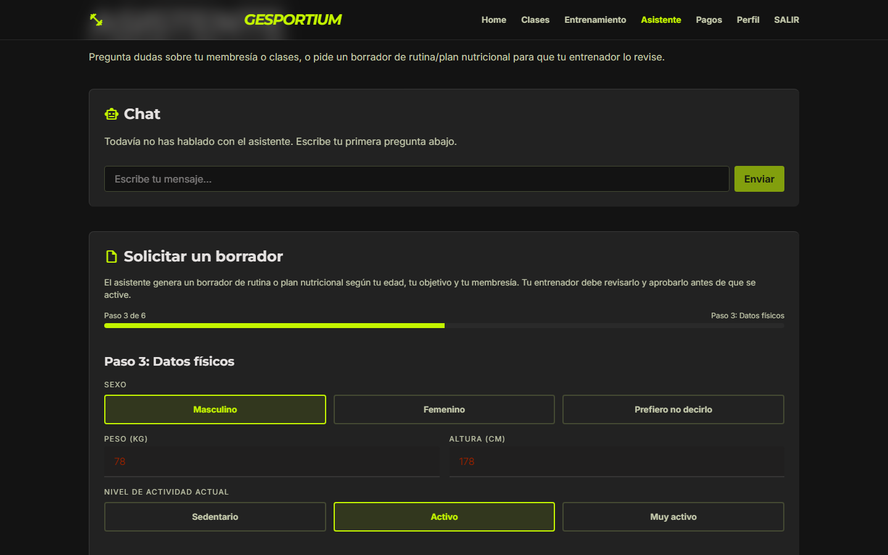
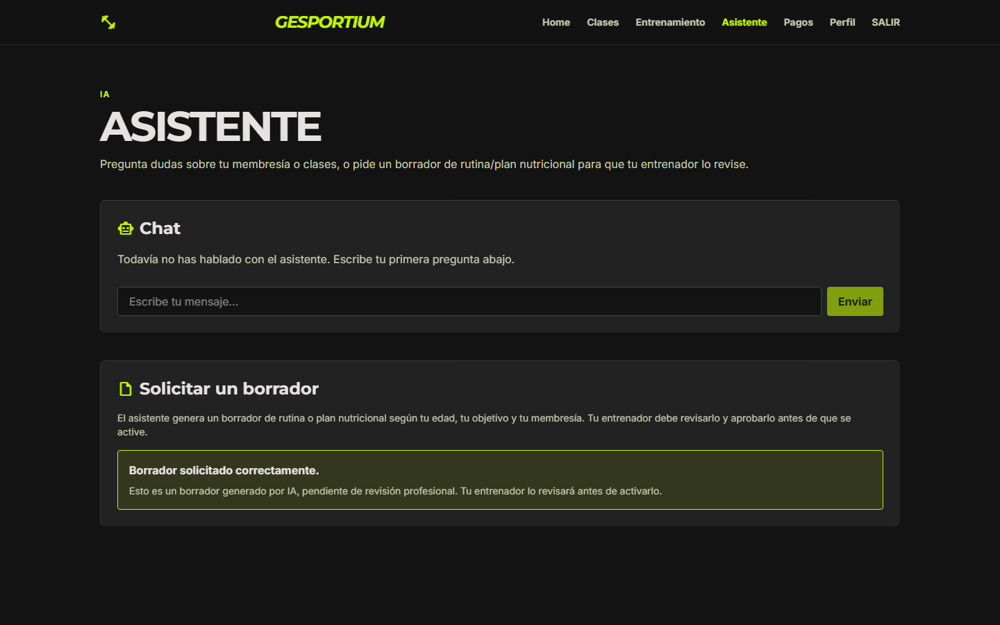
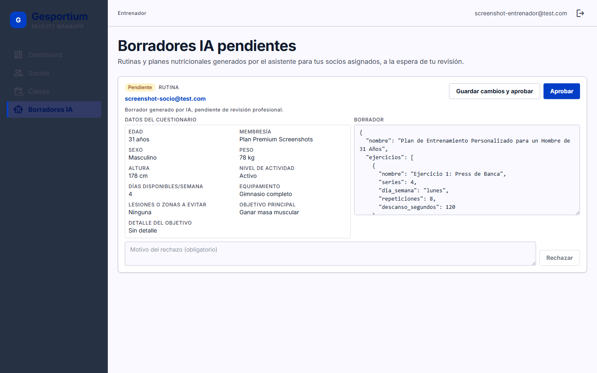

# Gesportium

Sistema de gestión para cadenas de gimnasios: socios, membresías, entrenadores,
rutinas y planes nutricionales, pagos y facturación, control de acceso, CRM de
leads, informes y un asistente de IA local que ayuda a socios y entrenadores.
Backend API-first en FastAPI + dos frontends en React (portal del socio y
panel de administración).

> ⚠️ **Estado: en fase de pruebas activa.** Este es un proyecto personal en
> desarrollo continuo, construido con un flujo spec-driven (spec → plan →
> tareas → implementación) módulo a módulo. La mayoría de los módulos tienen
> backend y tests cubiertos; el frontend está más avanzado en unos módulos que
> en otros. No es una versión final ni está pensado para producción tal cual
> — puede haber cambios de esquema, endpoints en evolución y funcionalidades
> pendientes. Ver [`CHANGELOG.md`](CHANGELOG.md) para el histórico real de
> cambios y [`roadmap/roadmap.md`](roadmap/roadmap.md) para lo que queda por
> delante.

## Stack


- **Backend**: FastAPI + SQLAlchemy 2.0 + Alembic + PostgreSQL, autenticación
  JWT (`python-jose`), contraseñas con `bcrypt`, tests con `pytest`/`httpx`,
  generación de PDFs de factura (`reportlab`) y exportables (`openpyxl`).
- **Frontend**: React 19 + Vite + React Router + Tailwind CSS 4, dos
  aplicaciones independientes dentro de `frontend/src/` (`portal-socio` y
  `panel-admin`) que comparten componentes en `frontend/src/shared/`.
- **IA local**: [Ollama](https://ollama.com/) sirviendo un modelo local
  (`llama3.2` por defecto) para el asistente conversacional y la generación
  de borradores de rutinas/planes nutricionales — nunca se activa nada sin
  revisión humana de un entrenador.

## Arquitectura

Backend API-first en un único servicio FastAPI, organizado por módulos de
dominio (`backend/app/modules/`), cada uno con su propio router, modelos,
schemas, servicio y tests. Dos frontends independientes consumen esa misma
API sobre roles distintos:

- **`portal-socio`** — lo que ve un socio: sus clases y reservas, su
  entrenamiento, pagos, perfil y el asistente de IA.
- **`panel-admin`** — lo que ven admin, gestor de sede y entrenador: gestión
  CRUD de sedes, socios, membresías, clases, entrenadores, pagos/remesas,
  leads, informes y la revisión de borradores generados por IA.

```
Gesportium/
├── backend/        API FastAPI (un módulo de dominio por carpeta)
├── frontend/        React + Vite (portal-socio + panel-admin)
├── specs/           Especificación de cada módulo (spec → plan → tasks)
├── bocetos/         Mockups visuales de referencia (Stitch)
└── roadmap/         Roadmap de producto
```

## Proceso de desarrollo

Cada módulo se desarrolló con un flujo spec-driven completo (spec → plan →
tareas → implementación → verificación), documentado en [`specs/`](specs/),
trabajando con [Claude](https://claude.com/product/claude-code) como
asistente de desarrollo en cada fase — desde la redacción de las propias
specs hasta la implementación y la revisión de código. Ningún hallazgo se
daba por cerrado sin verificación explícita: tests automatizados con
`pytest`, y verificación manual con Playwright contra el backend y Ollama
reales antes de marcar una tarea como hecha. [`CHANGELOG.md`](CHANGELOG.md)
recoge varios casos concretos de bugs reales detectados y corregidos durante
ese proceso (condición de carrera en la numeración de facturas,
contaminación de la base de datos de tests, validación inconsistente entre
schema y base de datos).

## Módulos

Cada módulo tiene su especificación completa (`spec.md`, `plan.md`,
`tasks.md`) en [`specs/`](specs/):

| # | Módulo | Qué hace |
|---|--------|----------|
| 001 | Identidad y roles | Autenticación JWT y autorización por rol (admin, gestor_sede, entrenador, socio) |
| 002 | Sedes | Gestión de las sedes físicas de la cadena |
| 003 | Socios | Datos personales, historial y documentación de socios |
| 004 | Membresías | Planes de suscripción: alta, renovación, congelación, baja |
| 005 | Clases y reservas | Catálogo de clases con aforo y reservas de socios |
| 006 | Entrenadores | Perfil profesional y asignación de socios a entrenadores |
| 007 | Planes de entrenamiento y nutrición | Rutinas y planes nutricionales creados por entrenadores |
| 008 | Pagos y facturación | Cobro de membresías, facturas en PDF, gestión de impagos |
| 009 | Control de acceso | Registro de entrada/salida física en sede |
| 010 | CRM de leads | Captación de clientes potenciales hasta conversión o descarte |
| 011 | Notificaciones | Avisos automáticos por email/push disparados por eventos |
| 012 | Dashboard principal | Métricas clave del negocio de un vistazo |
| 013 | Informes | Informes detallados exportables, con resúmenes generados por IA |
| 014 | Configuración general | Parámetros globales y por sede sin tocar código |
| 015 | Portal de socio | Frontend orientado al socio |
| 016 | Asistente IA conversacional | Chat local (Ollama) + wizard de generación de borradores de rutina/plan nutricional, siempre pendientes de aprobación de un entrenador |
| 017 | Panel de administración | Frontend de gestión para admin/gestor_sede/entrenador |

(018 y 019 son módulos de infraestructura del propio repositorio —
aislamiento del entorno de tests y control de versiones — sin funcionalidad
de producto.)

## Capturas

**Wizard de generación de borrador (portal del socio)** — el socio responde
un cuestionario guiado paso a paso; el resultado nunca se activa solo, queda
pendiente de revisión de un entrenador.




**Revisión del entrenador (panel de administración)** — el entrenador ve el
cuestionario que respondió el socio junto al borrador generado, y puede
aprobarlo tal cual, editarlo y aprobarlo, o rechazarlo con motivo.



## Cómo levantarlo en local

Necesitas PostgreSQL, Python 3.12+, Node.js y [Ollama](https://ollama.com/)
corriendo en local.

### 1. Base de datos

```bash
# Crea la base de datos (ajusta usuario/contraseña a los tuyos)
createdb gesportium
```

### 2. Backend

```bash
cd backend
python -m venv venv
venv\Scripts\activate          # En Windows. En Unix: source venv/bin/activate
pip install -r requirements.txt

copy .env.example .env         # En Unix: cp .env.example .env
# Edita .env: DATABASE_URL, JWT_SECRET_KEY, TOTEM_API_KEY, OLLAMA_BASE_URL/OLLAMA_MODEL

alembic upgrade head            # Aplica todas las migraciones
uvicorn app.main:app --reload   # Sirve la API en http://localhost:8000
```

`backend/.env.example` documenta también `TEST_DATABASE_URL`: los tests usan
una base de datos separada (por defecto `<nombre>_test`, creada sola) para no
tocar nunca los datos de desarrollo.

### 3. Ollama (asistente IA)

```bash
ollama pull llama3.2
ollama serve                    # Expone la API en http://localhost:11434
```

### 4. Frontend

```bash
cd frontend
npm install
npm run dev                     # Sirve la app en http://localhost:5173
```

El portal de socio y el panel de administración viven en el mismo proyecto
Vite (`/` y `/admin` respectivamente — ver `frontend/src/App.jsx`).

### 5. Tests del backend

```bash
cd backend
pytest
```

## Licencia

[MIT](LICENSE) — Copyright (c) 2026 Juan Enrique Ruiz.
